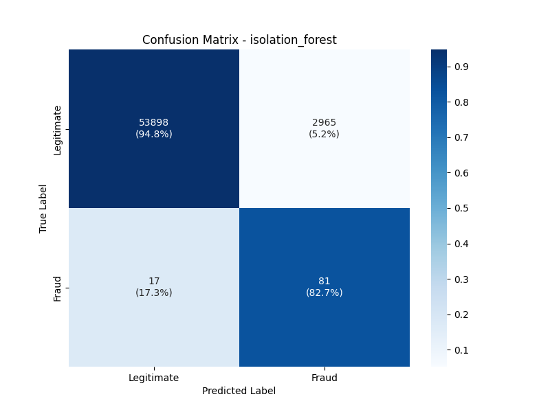
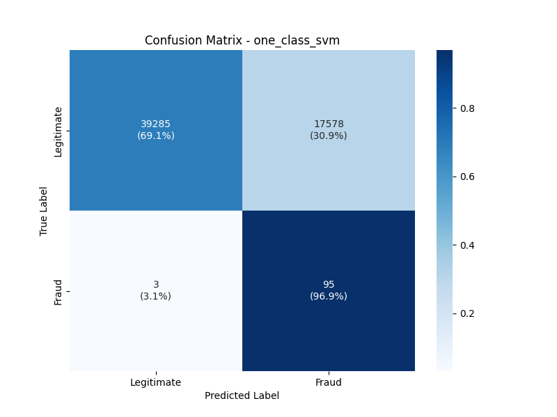
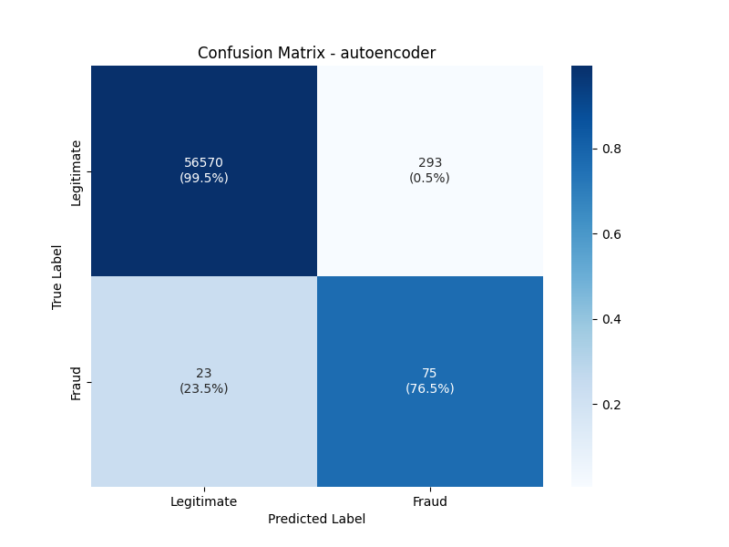

<div align="center">

# Credit Card Fraud Detection


**Unsupervised anomaly detection for credit-card fraud — Isolation Forest, One-Class SVM, and a PyTorch Autoencoder, tuned with random search against a recall-weighted score and evaluated by AUC-PR.**

<!-- TODO: replace with live Streamlit URL once deployed -->
[Live demo](#) · [EDA notebook](notebooks/eda.ipynb)

</div>

---

## Overview

Credit-card fraud is a textbook **imbalanced classification** problem: in the dataset used here, only **~0.17%** of transactions are fraudulent. Plain accuracy is meaningless — predicting "not fraud" everywhere already scores 99.83%.

This project takes an **unsupervised** approach. Each model learns the shape of legitimate transactions, then flags any transaction whose anomaly score crosses a learned threshold. Three model families are compared head-to-head:

- **Isolation Forest** — tree-based, fast, scales well to large datasets.
- **One-Class SVM** — kernel-based decision boundary around the "normal" region.
- **Autoencoder (PyTorch)** — a small neural network trained to reconstruct legitimate transactions; flags anything it reconstructs poorly.

Models are tuned by random search against a custom **recall-weighted score** (0.6 × recall + 0.4 × precision) on a held-out validation set, and the final test-set metric is **AUC-PR**, the standard headline metric for imbalanced binary classification.

---

## Quick start

```bash
# 1. Install dependencies
pip install -r requirements.txt

# 2. Place the Kaggle "Credit Card Fraud Detection" dataset (mlg-ulb)
#    at data/raw/creditcard.csv
#    https://www.kaggle.com/datasets/mlg-ulb/creditcardfraud

# 3. Preprocess (stratified split + robust scaling + cyclic time features)
python -m src.preprocess

# 4. Train + tune all three models
python -m src.train

# 5. Evaluate on the test set (writes confusion matrices and PR curves to assets/)
python -m src.evaluate

# 6. Optional: launch the interactive demo
streamlit run app.py
```

---

## Results

Test set: 56,961 transactions, 98 fraudulent (~0.17%). Metrics are reported for the **fraud class** (the negative class is uninformative under this much imbalance).

| Model | Precision | Recall | F1 | False positives | False negatives | AUC-PR |
|-------|----------:|-------:|---:|----------------:|----------------:|-------:|
| Isolation Forest | 0.03 | 0.85 | 0.06 | 2,607 | 15 | 0.208 |
| One-Class SVM    | 0.01 | 0.88 | 0.02 | 6,903 | 12 | 0.093 |
| Autoencoder      | 0.10 | 0.79 | 0.18 |   693 | 21 | **0.261** |

<details>
<summary>Confusion matrices (click to expand)</summary>





</details>

### Interpretation

**Headline metric:** AUC-PR (Area Under the Precision-Recall curve). Unlike accuracy or AUC-ROC, AUC-PR is robust to severe class imbalance — it's the metric of choice when the positive class is rare.

The **Autoencoder leads on both AUC-PR and operational cost**: its 693 false positives represent ~1.2% of legitimate test transactions — manageable for a manual-review queue. **Isolation Forest** follows at AUC-PR 0.208 with 2,607 false positives; decent but noisier. **One-Class SVM** reaches the highest raw recall (0.88) but flags 6,903 legitimate transactions as fraudulent (~12% false-positive rate), making it impractical in this configuration.

The recall-weighted tuning objective successfully pushed all three models toward catching fraud. The Autoencoder wins because learning to reconstruct the full distribution of legitimate transactions provides richer signal than fitting a single decision boundary around a sample of normal points.

---

## Approach

### Preprocessing — [src/preprocess.py](src/preprocess.py)

- **Stratified train / validation / test split** (60 / 20 / 20) on the `Class` column to preserve the ~0.17% fraud rate in every split.
- **Robust scaling on `Amount`** only — the other features (`V1`–`V28`) are already PCA outputs from the source dataset and don't need re-scaling.
- **Cyclic time encoding**: `Time` is converted to `Time_sin` / `Time_cos` with a 24-hour period to capture diurnal patterns in fraud activity.
- The autoencoder is trained only on legitimate transactions (`X_legit.npy`); Isolation Forest and OCSVM train on the full mixed training set.

### Modeling — [src/models/](src/models/)

A `BaseModel` abstract class defines the common interface (`fit`, `predict`, `anomaly_scores`, `save`, `load`). Each model overrides only `_fit` and `anomaly_scores`. The decision threshold is computed once during `fit()` from training-set scores and frozen — predictions do **not** depend on the predict-time batch.

| Model | Anomaly score | Tuned hyperparameters |
|-------|--------------|------------------------|
| Isolation Forest | `-decision_function(X)` | `n_estimators`, `max_features`, `contamination`, `max_samples`, `threshold_percentile` |
| One-Class SVM    | `-decision_function(X)` | `kernel`, `nu`, `threshold_percentile` |
| Autoencoder      | per-sample reconstruction MSE | `latent_dim`, `learning_rate`, `batch_size`, `threshold_percentile` |

### Tuning — [src/train.py](src/train.py)

50-iteration random search per model, scored on the validation set with the custom recall-weighted metric. Best parameters and the chosen threshold are persisted to `models/saved/best_params/<model>_best_params.json` for reproducibility.

---

## Design decisions

**Recall-weighted scoring (0.6 × recall + 0.4 × precision).** In fraud detection, missing real fraud is far more expensive than flagging a clean transaction — at worst, a false positive triggers a manual review. The asymmetric weights bake that cost into the tuning objective directly.

**OneClassSVM uses a 50% training-data subsample for the final fit.** sklearn's `OneClassSVM` has O(n²–n³) fit complexity; fitting on the full ~228k-row training set takes hours and large memory. Tuning uses a 25% subsample. This is a deliberate scaling tradeoff — at production data sizes the better fix would be `SGDOneClassSVM` or a Nystroem-kernel approximation, not raw OCSVM.

**Threshold frozen at fit time.** `BaseModel.fit()` is a template method: it calls each model's `_fit()`, computes anomaly scores on the training data, and stores the percentile-based threshold once. This means a model's decision boundary is a property of the trained model alone, not of whatever batch you happen to score next.

**Cyclic time encoding caveat.** The `Time` column in this dataset is "seconds since the first transaction" (~48 hours total), not literal time-of-day. Encoding it with a 24-hour cycle is a defensible approximation since the data spans roughly two days, but the assumption is worth documenting.

**Reproducibility.** Every random component (data split, random search, autoencoder weight init) is seeded from a single `random_state` in [config.yaml](config.yaml). Two runs yield identical results.

---

## Project structure

```
.
├── config.yaml                # Single source of truth: paths, hyperparameters, param spaces
├── data/
│   ├── raw/                   # Source CSV (gitignored)
│   └── processed/             # NumPy arrays after preprocessing (gitignored)
├── models/saved/              # Trained models + best params (gitignored)
├── notebooks/
│   └── eda.ipynb              # Exploratory data analysis
├── src/
│   ├── config.py              # Loads config.yaml
│   ├── preprocess.py          # Data loading, splitting, scaling, feature engineering
│   ├── train.py               # Random-search tuning + final fit
│   ├── evaluate.py            # Test-set metrics, confusion matrices, PR curves
│   └── models/
│       ├── base.py            # BaseModel abstraction (template-method fit)
│       ├── registry.py        # Model factory + per-model sample rates
│       ├── isolation_forest.py
│       ├── one_class_svm.py
│       └── autoencoder.py
└── app.py                     # Streamlit demo (TODO)
```

---

## What's next

- **Deploy the Streamlit demo** to Streamlit Community Cloud and link it at the top of this README.
- **Early stopping** for the autoencoder (currently uses fixed epoch count).
- **Supervised baseline** (LightGBM / XGBoost with class-weighted loss) to quantify the cost of going unsupervised on a problem where labels actually exist.
- **Structured logging** to replace `print` calls.
- **Unit tests** for the preprocessing pipeline and the `BaseModel.save` / `load` roundtrip.

---

## Tech stack

Python 3.10+ · scikit-learn · PyTorch · pandas · NumPy · Matplotlib · Seaborn · PyYAML · joblib.

## License

MIT — see [LICENSE](LICENSE).
